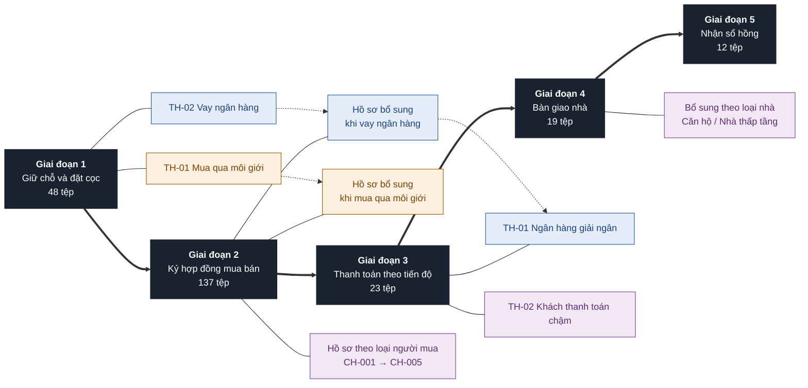
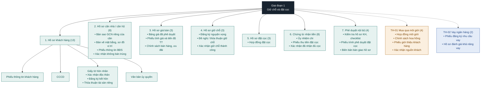
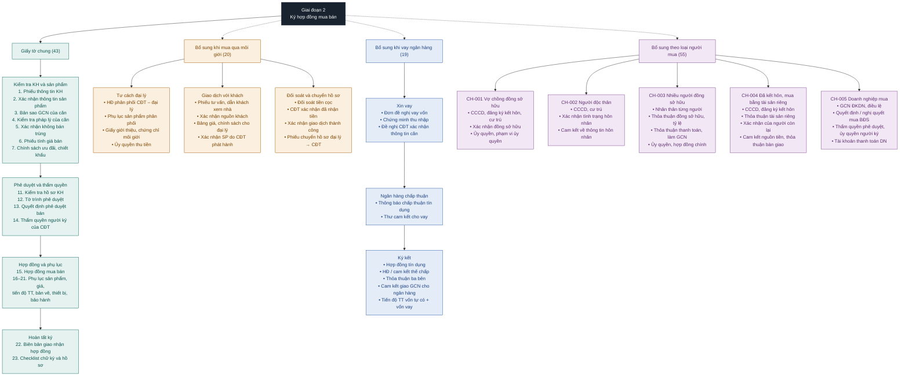
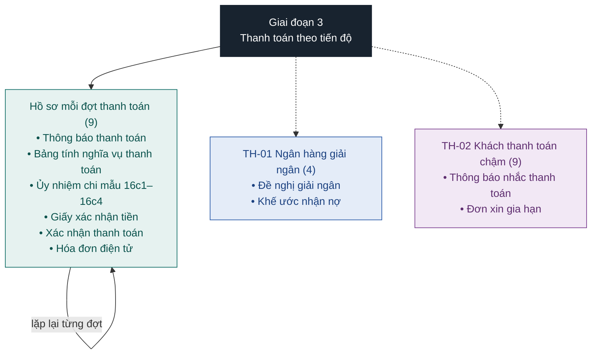
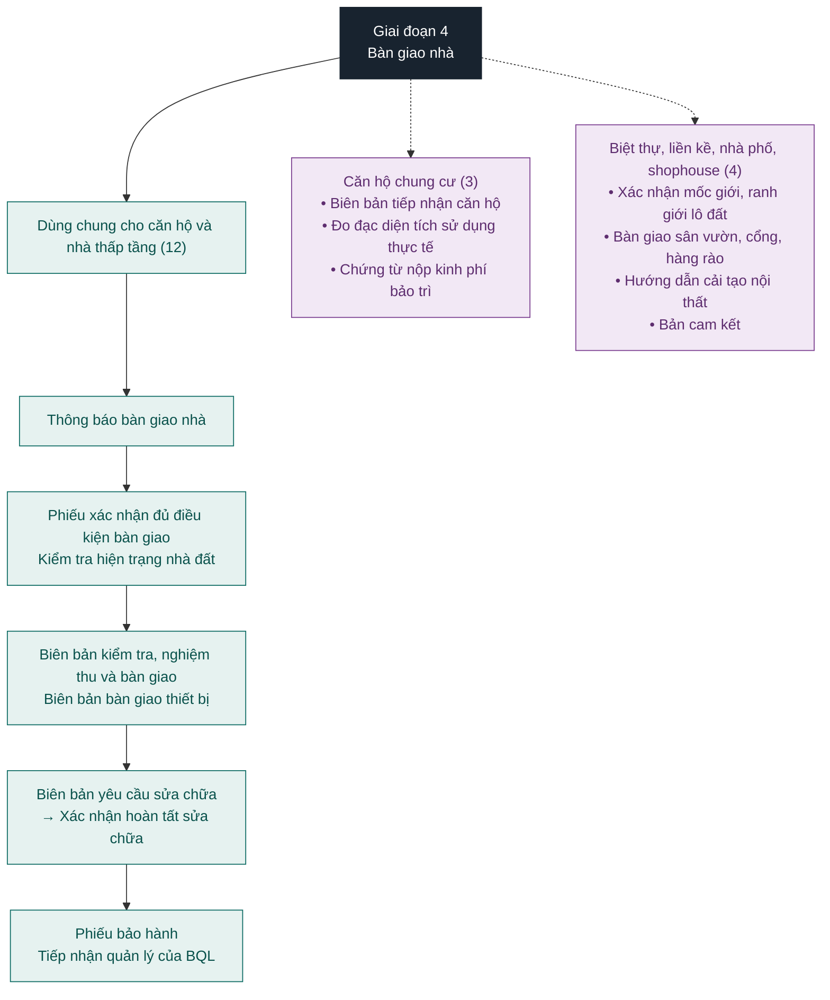
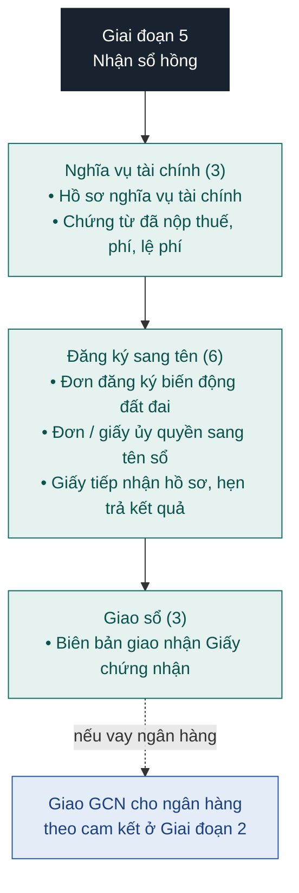

# Form Data – Hệ thống hồ sơ mua bán bất động sản

Thư mục chứa 239 biểu mẫu, chia theo 5 giai đoạn của một giao dịch mua bán. Mỗi giai đoạn có **hồ sơ chung** (luôn phải có) và **hồ sơ bổ sung** (chỉ dùng khi giao dịch rơi vào trường hợp đó).

Chú thích màu trong sơ đồ:

- 🟩 Hồ sơ chung, bắt buộc
- 🟧 Mua qua môi giới / đại lý
- 🟦 Vay ngân hàng
- 🟪 Theo loại người mua / loại nhà / phát sinh

## 1. Sơ đồ tổng quan

## 2. Chi tiết từng giai đoạn

### Giai đoạn 1 – Giữ chỗ và đặt cọc

### Giai đoạn 2 – Ký hợp đồng mua bán

### Giai đoạn 3 – Thanh toán theo tiến độ

### Giai đoạn 4 – Bàn giao nhà

### Giai đoạn 5 – Nhận sổ hồng

## 3. Cách chọn hồ sơ cho một giao dịch

1. Ngay ở giai đoạn 1, trả lời 3 câu hỏi: khách đến qua môi giới không? Có vay ngân hàng không? Khách thuộc nhóm người mua nào (CH-001 đến CH-005)?
2. Ở mỗi giai đoạn, luôn lấy đủ **hồ sơ chung**, rồi cộng thêm nhánh bổ sung tương ứng với câu trả lời ở bước 1.
3. Nhánh **môi giới** kết thúc ở giai đoạn 2 bằng phiếu chuyển hồ sơ từ đại lý sang chủ đầu tư.
4. Nhánh **vay ngân hàng** kéo dài từ giai đoạn 1 đến giai đoạn 3 (đăng ký vay → ký tín dụng, thế chấp → giải ngân). Ở giai đoạn 5, Giấy chứng nhận giao cho ngân hàng theo cam kết.
5. Giai đoạn 4 chia nhánh theo **loại nhà**: căn hộ chung cư hoặc nhà thấp tầng, cộng với bộ giấy tờ dùng chung.
